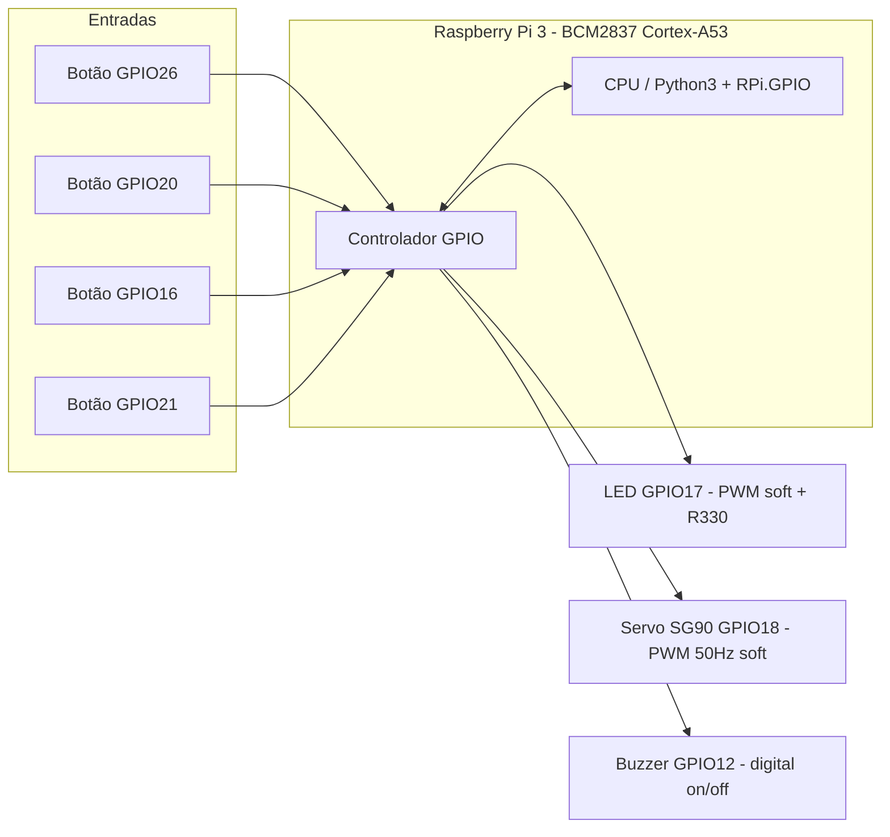
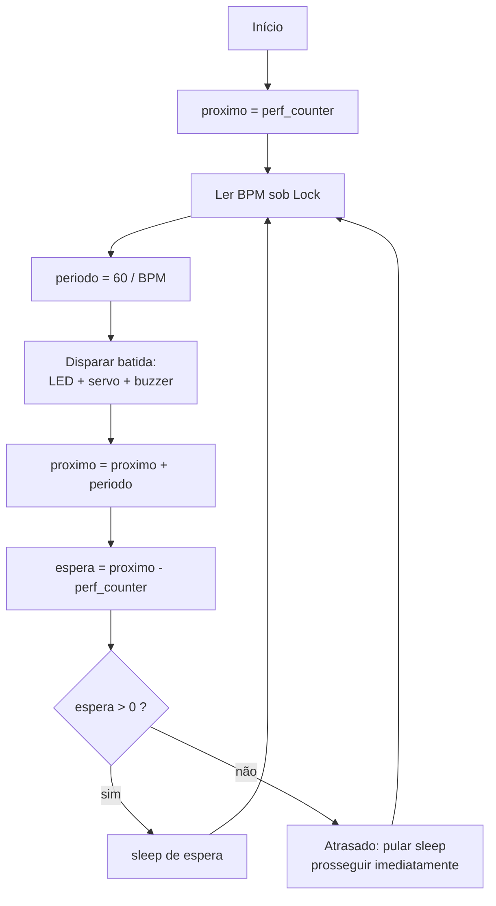

# Relatório da Experiência 7 — Metrônomo com Temporização e PWM no Raspberry Pi 3

**PCS3732 — Laboratório de Processadores**
**Escola Politécnica da Universidade de São Paulo**

---

## 1. Introdução e objetivos

Esta experiência tem por objetivo projetar, implementar e validar um **metrônomo eletrônico** sobre um **Raspberry Pi 3 Model B**, explorando conceitos de temporização precisa, modulação por largura de pulso (PWM) e concorrência (multithreading) em um sistema operacional de propósito geral. O metrônomo produz batidas periódicas — por padrão a **60 BPM (batimentos por minuto), o que equivale a 1 Hz** — sinalizadas simultaneamente por três atuadores distintos: um **LED**, um **servomotor** e um **buzzer**. Botões permitem ajustar o andamento em tempo de execução.

O Raspberry Pi 3 é construído em torno do SoC Broadcom **BCM2837**, que integra um cluster **quad-core ARM Cortex-A53 (ARMv8, 64 bits) operando a 1,2 GHz** (RASPBERRY PI LTD, 2026a). Trata-se de uma arquitetura ARM de carregamento/armazenamento (*load-store*) cujos princípios de organização — pipeline, banco de registradores e conjunto de instruções — são descritos em profundidade por Furber (2000), enquanto a plataforma Raspberry Pi como computador de uso geral é apresentada por Upton e Halfacree (2017). Sobre esse hardware roda o **Raspberry Pi OS, um Linux de propósito geral — não um sistema operacional de tempo real (RTOS)**, fato que permeia todas as decisões de engenharia deste projeto.

Os objetivos específicos são:

- **RF01 (temporização):** gerar batidas isócronas a 1 Hz (60 BPM) com erro que **não se acumule** ao longo do tempo (ausência de *drift*).
- **RF02 (ajuste de andamento):** permitir alterar o BPM por botões, sem interromper o laço temporal.
- **RF03 (atuação multimodal):** acionar LED, servomotor e buzzer de forma coordenada a cada batida.
- **RNF01 (robustez temporal):** manter a estabilidade da cadência mesmo sob a preempção e o *jitter* típicos de um Linux não-RTOS.

A estratégia central para atender ao RF01/RNF01 é a **correção de *drift* por agenda absoluta**: em vez de `sleep(periodo)`, o laço calcula instantes-alvo acumulados (`proximo += periodo`) medidos com o relógio monotônico `time.perf_counter()`, de forma que atrasos pontuais de uma batida sejam descontados na seguinte, e não somados (KERRISK, 2024a).

---

## 2. Materiais e montagem

**Hardware:**

- Raspberry Pi 3 Model B (SoC BCM2837, ARM Cortex-A53 quad-core 64 bits) executando Raspberry Pi OS.
- Placa de expansão **Freenove Projects Board**.
- LED de sinalização com resistor limitador de **330 Ω**.
- Servomotor **SG90** (PWM 50 Hz, pulso de 1,0 a 2,0 ms).
- Buzzer acionado por sinal digital on/off.
- Botões coloridos da Freenove (*active-low*, com *pull-up* interno).

**Software:** Python 3 com a biblioteca **RPi.GPIO** (CROSTON, [s.d.]).

### 2.1 Tabela de pinos (numeração BCM)

| Componente | GPIO (BCM) | Função | Configuração elétrica |
|---|---|---|---|
| LED | GPIO17 | PWM por software (brilho) | Saída digital + resistor 330 Ω |
| Servomotor SG90 | GPIO18 | PWM por software, 50 Hz | Saída digital; coincide com PWM0 nativo¹ |
| Buzzer | GPIO12 | Sinal digital on/off | Saída digital; coincide com PWM0 nativo¹ |
| Botão 1 | GPIO26 | Entrada de evento | *Active-low*, *pull-up* interno, borda de descida, `bouncetime=200 ms` |
| Botão 2 | GPIO20 | Entrada de evento | *Active-low*, *pull-up* interno, borda de descida, `bouncetime=200 ms` |
| Botão 3 | GPIO16 | Entrada de evento | *Active-low*, *pull-up* interno, borda de descida, `bouncetime=200 ms` |
| Botão 4 | GPIO21 | Entrada de evento | *Active-low*, *pull-up* interno, borda de descida, `bouncetime=200 ms` |

¹ Observação relevante para a Seção 8.1: **GPIO18 e GPIO12 são justamente as duas saídas nativas do canal de hardware PWM0** do BCM2837 (MCCAULEY, [s.d.]; JOAN, [s.d.]c). No entanto, a biblioteca RPi.GPIO **não usa** o PWM por hardware: gera PWM por software. O buzzer, por ser apenas on/off, não emprega PWM de forma alguma.

### 2.2 Diagrama de blocos da arquitetura física



**Legenda — Figura 1:** Arquitetura física do metrônomo. Os botões (entradas *active-low*) chegam ao controlador GPIO, que é lido/escrito pela CPU executando Python com RPi.GPIO. As saídas acionam os três atuadores. O Raspberry Pi 3 ocupa o centro do sistema.

---

## 3. Implementação isolada dos atuadores

Seguindo boa prática de engenharia, cada atuador foi implementado e validado em **módulos isolados** (`led_pwm.py`, `servo.py`, `buzzer.py`) antes da integração. Isso reduz o espaço de busca durante a depuração (Seção 6).

### 3.1 LED por PWM e teste de frequências (`led_pwm.py`)

O LED é acionado por PWM por software da RPi.GPIO. A API expõe `GPIO.PWM(canal, frequencia)`, `start(dutycycle)`, `ChangeFrequency()` e `ChangeDutyCycle()` (CROSTON, [s.d.]). O **duty cycle** (fração do período em que o pino permanece em nível alto) controla o **brilho aparente**: quanto maior a fração de tempo ligado, maior a energia luminosa média integrada pelo olho, e mais brilhante o LED parece — ainda que o LED, instantaneamente, apenas alterne entre ligado e desligado.

O módulo `led_pwm.py` **varre uma faixa de frequências** de PWM para evidenciar o fenômeno da **cintilação (*flicker*) versus fusão (persistência da visão)**. Em frequências baixas (por exemplo, poucos hertz), o olho percebe a alternância como piscar. À medida que a frequência sobe, a partir de certo ponto — a chamada *frequência crítica de fusão de cintilação* — o sistema visual **integra** os pulsos e passa a perceber luz contínua de intensidade proporcional ao duty cycle. É por isso que o PWM funciona como controle de brilho: acima da frequência de fusão, a variação de duty cycle traduz-se diretamente em brilho percebido, sem piscar visível.

Um ponto importante: como o Raspberry Pi OS é um Linux de propósito geral, o PWM por software está sujeito ao *jitter* do escalonador e ao GIL do Python (Seções 8.1–8.3). **Para o LED isso é irrelevante**: o olho integra a intensidade e um pequeno tremor no duty cycle não é perceptível (NUTTALL et al., 2025). Como referência de projeto maduro, a abstração `PWMLED` da biblioteca gpiozero usa por padrão **100 Hz** de frequência de PWM (NUTTALL et al., 2025) — valor bem acima da frequência de fusão, adequado para brilho estável.

### 3.2 Servomotor por PWM (`servo.py`)

O servomotor SG90 é um servo de posição comandado por **PWM de 50 Hz** (período de 20 ms), no qual a **largura do pulso** codifica o ângulo desejado. A convenção usual mapeia pulsos de **1,0 ms a 2,0 ms** sobre a faixa de 0° a 180°:

| Largura do pulso | Duty cycle (período 20 ms) | Ângulo |
|---|---|---|
| 1,0 ms | 5,0 % | 0° |
| 1,5 ms | 7,5 % | 90° (centro) |
| 2,0 ms | 10,0 % | 180° |

O módulo `servo.py` gera esse sinal via RPi.GPIO em GPIO18. É importante registrar a limitação teórica: por ser **PWM por software**, a largura do pulso está sujeita a variações (*jitter*) causadas pela preempção do escalonador e pelo GIL. Diferentemente do LED, o servo a 50 Hz **traduz o jitter no comprimento do pulso em tremor mecânico** perceptível — o conhecido *servo jitter* (NUTTALL et al., 2025). A documentação do gpiozero recomenda explicitamente, para reduzir esse tremor, **usar o driver pigpio em vez do RPi.GPIO padrão, pois o pigpio usa amostragem por DMA para temporização de bordas muito mais precisa** (NUTTALL et al., 2025). A discussão completa dessa hierarquia de estabilidade está na Seção 8.1. Para fins didáticos, este projeto mantém a RPi.GPIO por simplicidade, tratando o tremor do servo como hipótese a confirmar (Seção 7).

### 3.3 Buzzer (`buzzer.py`)

Há duas famílias de buzzers, e a distinção é essencial:

- **Buzzer ativo:** possui oscilador interno; basta aplicar um nível digital para produzir som em frequência fixa. O controle é puramente **on/off digital** — não requer PWM.
- **Buzzer passivo:** não tem oscilador; comporta-se como um pequeno alto-falante. É preciso **alimentá-lo com um sinal alternado (tom) na frequência desejada**, tipicamente por PWM, para controlar a altura (*pitch*) da nota.

No projeto, o buzzer em **GPIO12 é acionado por sinal digital on/off** (comportamento de buzzer ativo): a cada batida do metrônomo, `buzzer.py` liga o pino por um curto instante e o desliga. Portanto, embora GPIO12 coincida fisicamente com uma saída de hardware PWM0 do BCM2837 (MCCAULEY, [s.d.]), **este atuador não usa PWM** — a temporização da batida vem do laço principal (Seção 4). Caso se desejasse variar a nota (buzzer passivo), gerar-se-ia um tom por PWM na frequência da nota-alvo.

---

## 4. Integração: o metrônomo de 1 Hz (`metronomo.py`)

O módulo `metronomo.py` reúne os atuadores sob um único laço temporal e uma arquitetura concorrente.

### 4.1 Correção de *drift* por agenda absoluta

A implementação ingênua de um metrônomo — `while True: tick(); sleep(periodo)` — **acumula erro**. Cada `sleep()` acorda com um pequeno atraso (custo do `tick()`, latência do escalonador, arredondamento do timer), e como o intervalo seguinte é contado **a partir do instante real de despertar**, esses atrasos se **somam**, fazendo o erro crescer sem limite ao longo dos minutos (KERRISK, 2024a). A documentação do Python é explícita ao advertir que o tempo de suspensão de `sleep()` "pode ser maior que o solicitado por uma quantidade arbitrária, por causa do escalonamento de outras atividades no sistema" (PYTHON SOFTWARE FOUNDATION, 2026b).

A solução adotada ancora cada batida a uma **agenda absoluta**:

```python
proximo += periodo
sleep(proximo - perf_counter())
```

Assim, um atraso numa batida é descontado na seguinte, e o erro **deixa de acumular** — resta apenas um *jitter* limitado em torno do alvo, nunca deriva (KERRISK, 2024a). Este é exatamente o padrão recomendado no nível do kernel: a página de manual do `clock_nanosleep(2)` orienta a "chamar `clock_gettime()`, somar o intervalo desejado ao valor retornado e chamar `clock_nanosleep()` com a flag `TIMER_ABSTIME`", justamente porque "usar um timer absoluto é útil para prevenir problemas de deriva do timer" (KERRISK, 2024a). Como o CPython não expõe `TIMER_ABSTIME` no módulo `time`, recomputa-se o intervalo relativo (`proximo - perf_counter()`) a cada iteração — a tradução Python do dormir-até-um-instante-absoluto (KERRISK, 2024a).

A escolha de `time.perf_counter()` é deliberada: trata-se de um relógio **monotônico**, que "não pode andar para trás" e "não é afetado por atualizações do relógio do sistema"; a partir do CPython 3.13 ele usa o mesmo relógio de `time.monotonic()` e oferece a maior resolução disponível (PYTHON SOFTWARE FOUNDATION, 2026b; STINNER, 2012). Não se usa `time.time()` (relógio de parede), que pode saltar para trás por ajuste de NTP.

### 4.2 Arquitetura multithread

O laço crítico de 1 Hz roda na **thread principal**. Os botões são atendidos por **callbacks** (executados na thread de eventos do RPi.GPIO), que **apenas atualizam variáveis globais** — em especial o **BPM, protegido por um `Lock`** — e retornam imediatamente, **sem nunca bloquear o laço temporal**. Essa divisão é sólida à luz das restrições do CPython: por causa do **GIL, apenas uma thread executa bytecode Python de cada vez** e a `threading` não acelera trabalho CPU-bound (PYTHON SOFTWARE FOUNDATION, 2026a). Contudo, o trabalho dos callbacks é **essencialmente de espera de eventos** (I/O-bound) e leve, cenário em que a `threading` é adequada, pois o GIL é liberado durante a espera e não há disputa real de CPU com o laço (PYTHON SOFTWARE FOUNDATION, 2026a). A análise completa de paralelismo está na Seção 8.4.

### 4.3 Fluxograma do laço com correção de *drift*



**Legenda — Figura 2:** Laço do metrônomo com correção de *drift*. O instante-alvo `proximo` é incrementado por `periodo` (agenda absoluta), e o `sleep` dorme apenas o tempo restante até o alvo. Se a iteração atrasou (`espera ≤ 0`), o sleep é pulado, de modo que o erro não se propaga para as batidas seguintes.

### 4.4 Diagrama de sequência

```mermaid
sequenceDiagram
    actor U as Usuário
    participant BT as Thread de botões (RPi.GPIO)
    participant MP as Thread principal (laço 1 Hz)
    participant HW as Hardware (GPIO/atuadores)
    U->>BT: Pressiona botão (borda de descida)
    Note over BT: bouncetime=200 ms
    BT->>BT: adquire Lock, atualiza BPM, libera Lock
    loop A cada período
        MP->>MP: lê BPM sob Lock, calcula período
        MP->>HW: aciona LED, servo e buzzer (batida)
        MP->>MP: proximo += periodo; sleep até o alvo
    end
```

**Legenda — Figura 3:** Interação entre o usuário, a thread de eventos dos botões e a thread principal. Os botões apenas atualizam o BPM protegido por `Lock`; a thread principal, desacoplada, lê o BPM e comanda o hardware no ritmo da agenda absoluta, sem ser bloqueada pelos callbacks.

---

## 5. Plano de integração

A integração é incremental, validando cada camada antes de acrescentar a próxima. Cada etapa possui **critérios de aceite** ligados aos requisitos.

**Etapa 1 — Validar cada atuador isolado.**
Executar `led_pwm.py`, `servo.py` e `buzzer.py` separadamente.
*Critério de aceite (RF03):* o LED varia brilho e funde acima da frequência de fusão; o servo atinge 0°, 90° e 180° para pulsos de 1,0/1,5/2,0 ms; o buzzer emite som audível ao comando on/off.

**Etapa 2 — Juntar servo + buzzer com temporização.**
Integrar servo e buzzer sob o laço de 1 Hz com agenda absoluta.
*Critério de aceite (RF01, RNF01):* servo e buzzer disparam sincronizados a cada 1 s; o período medido com `perf_counter()` mantém-se em 1,000 s ± jitter, **sem drift acumulado** ao longo de vários minutos.

**Etapa 3 — Acrescentar o LED.**
Adicionar o LED como sinal visual da batida.
*Critério de aceite (RF03):* os três atuadores disparam de forma coordenada, sem que o PWM por software do LED perturbe a cadência.

**Etapa 4 — Acrescentar os botões.**
Ligar os callbacks de GPIO26/20/16/21 que ajustam o BPM sob `Lock`.
*Critério de aceite (RF02, RNF01):* pressionar um botão altera o andamento (ex.: ±5 BPM) e o novo período passa a valer na iteração seguinte, **sem travar nem introduzir salto** no laço; o `bouncetime=200 ms` evita disparos múltiplos por repique.

---

## 6. Plano de depuração

Métodos previstos, organizados do menos ao mais intrusivo:

1. **Prints com timestamp:** registrar `perf_counter()` a cada batida para inspeção rápida da cadência. Simples, mas o próprio `print` adiciona latência — usar com parcimônia.
2. **Medir o período e levantar histograma de *jitter*:** coletar os intervalos entre batidas com `time.perf_counter()` (relógio monotônico de alta resolução, imune a ajustes de relógio de parede — PYTHON SOFTWARE FOUNDATION, 2026b) e construir um histograma. Distingue **drift** (média deslocada/derivando) de **jitter** (dispersão em torno da média).
3. **Analisador lógico / osciloscópio nas GPIOs:** observar diretamente as bordas em GPIO17/18/12. É o padrão-ouro para medir a **largura real do pulso** do servo a 50 Hz e confirmar objetivamente o *servo jitter* do PWM por software.
4. **Isolar variáveis (um atuador por vez):** reexecutar os módulos isolados da Seção 3 para separar defeito de hardware, de fiação e de software.
5. **LED como sonda visual:** usar o LED como indicador de estado (ex.: piscar na entrada do callback), aproveitando que o olho tolera bem o jitter do PWM por software.
6. **Verificar o `bouncetime` dos botões:** confirmar que 200 ms suprime o repique mecânico sem "engolir" pressões legítimas; ajustar se houver disparos múltiplos ou perdas.

---

## 7. Resultados: o que deu certo, o que deu errado e como refinar

> **Nota metodológica:** os valores medidos ainda **não foram coletados**; a tabela abaixo lista os resultados **esperados** e reserva a coluna **Medido** para preenchimento com os dados reais de bancada. Nenhum número de medição foi inventado.

| Grandeza / requisito | Esperado | Medido (preencher) |
|---|---|---|
| Período a 60 BPM (RF01) | 1,000 s por batida | [medir] |
| Drift após 5 min **sem** correção | erro cresce e acumula (segundos) | [medir] |
| Drift após 5 min **com** agenda absoluta (RF01) | erro não acumula; só jitter limitado | [medir] |
| Jitter de período (RNF01) | dispersão sub-ms a poucos ms | [medir] |
| Largura de pulso do servo (alvo 1,5 ms) | 1,5 ms ± tremor | [medir] |
| Faixa de ajuste de BPM por botão (RF02) | passo aplicado na iteração seguinte | [medir] |
| Falsos disparos de botão com `bouncetime=200 ms` | ~0 | [medir] |

### Problemas típicos esperados (hipóteses a confirmar)

- **Tremor do servo por PWM de software (H1):** como o servo a 50 Hz traduz jitter da largura de pulso em movimento mecânico, espera-se *servo jitter* visível (NUTTALL et al., 2025). *Como endereçar:* medir a largura do pulso com osciloscópio (Método 3); se confirmado, mitigar migrando o pulso do servo para DMA/hardware via pigpio (Seção 8.1).
- **Jitter do escalonador afetando o RF01 (H2):** por o Raspberry Pi OS ser um Linux de propósito geral (não-RTOS), o instante de despertar de cada `sleep` tem jitter (PYTHON SOFTWARE FOUNDATION, 2026b; Seção 8.3). *Como endereçar:* histograma de jitter (Método 2); para 1 Hz, espera-se que o jitter sub-ms seja imperceptível **desde que** a agenda absoluta impeça o drift.
- **Drift antes vs. depois da correção (H3):** espera-se drift crescente no laço ingênuo e drift nulo com a agenda absoluta (KERRISK, 2024a). *Como endereçar:* comparar as duas implementações no mesmo intervalo longo (Método 2).
- **Ruído de *bouncing* dos botões (H4):** repique mecânico pode gerar múltiplos eventos por pressão. *Como endereçar:* verificar o `bouncetime=200 ms` (Método 6) e contar falsos disparos.

O refinamento segue a hierarquia: manter o laço lógico em Python com agenda absoluta e, se o tremor do servo for confirmado como inaceitável, delegar o sinal físico crítico ao hardware/DMA.

---

## 8. Discussão teórica

### 8.1 Como o PWM é implementado no Raspberry Pi 3?

O SoC **BCM2837 herda do BCM2835 dois canais de PWM por hardware independentes (PWM0 e PWM1)**, ambos derivados de um **mesmo clock-source** (o clock de PWM, com divisor programável) e habilitáveis separadamente (MCCAULEY, [s.d.]). Cada canal só pode ser roteado para um subconjunto fixo de GPIOs em funções alternativas: **PWM0 sai em GPIO12 ou GPIO18, e PWM1 em GPIO13 ou GPIO19** (MCCAULEY, [s.d.]; JOAN, [s.d.]c). Como os dois GPIOs de um mesmo canal compartilham o gerador, não podem ter frequência/duty cycle diferentes ao mesmo tempo — na documentação do pigpio, "the latest frequency and dutycycle setting will be used by all GPIO which share a PWM channel" (JOAN, [s.d.]c).

No Linux, esses canais são expostos em espaço de usuário pela **interface sysfs `/sys/class/pwm`**: cada controlador vira `pwmchipN` (com `npwm`, `export`, `unexport`), e cada canal exportado cria `pwmX/` com `period`, `duty_cycle`, `polarity` e `enable`, **todos em nanossegundos**, exigindo `duty_cycle ≤ period` (LINUX KERNEL, [s.d.]).

É preciso distinguir **PWM por hardware** de **PWM por software**. No PWM por hardware, o periférico gera a onda de forma autônoma, sem carga de CPU e com jitter desprezível. Já a **RPi.GPIO — usada neste projeto para o LED (GPIO17) e para o servo (GPIO18) — implementa PWM inteiramente por software**: uma thread do interpretador Python liga/desliga o pino por temporização (CROSTON, [s.d.]). Isso a torna suscetível a jitter, porque o **Raspberry Pi OS é um Linux de propósito geral (não-RTOS)**, sujeito à preempção do escalonador, e o Python possui o **GIL** (PYTHON SOFTWARE FOUNDATION, 2026a). Para o LED isso é irrelevante; para o **servo a 50 Hz**, o jitter no comprimento do pulso (idealmente 1,0–2,0 ms dentro do período de 20 ms) provoca tremor mecânico — um problema documentado (NUTTALL et al., 2025).

Uma alternativa intermediária é o **pigpio**, que não depende apenas do hardware PWM (limitado a 4 GPIOs): ele gera **PWM e pulsos de servo temporizados por DMA**, pois "the PWM and servo pulses are timed using the DMA and PWM/PCM peripherals" (JOAN, [s.d.]b), com **sample rate configurável (1–10 µs, padrão 5 µs)** e formas de onda com precisão da ordem de poucos microssegundos (JOAN, [s.d.]a). O pigpio também oferece `hardware_PWM()` (nos GPIOs 12/13/18/19) e `set_servo_pulsewidth()` (0 = desligado, 500–2500 µs, 1500 µs = centro) (JOAN, [s.d.]a). A **hierarquia de estabilidade** é, portanto: PWM por software puro (RPi.GPIO) < PWM temporizado por DMA (pigpio) < PWM por hardware nativo.

No ecossistema atual, a Raspberry Pi recomenda o **gpiozero** como camada Python de alto nível, cuja documentação orienta, para reduzir *servo jitter*, "use the pigpio pin driver rather than the default RPi.GPIO driver (pigpio uses DMA sampling for much more precise edge timing)" (NUTTALL et al., 2025). O **wiringPi original foi descontinuado** (2019) e o **lgpio/libgpiod** é a via moderna para C. Conclusão para o metrônomo: a RPi.GPIO privilegia simplicidade didática; o LED tolera bem o PWM por software; o servo em GPIO18 ficaria mais estável com o pulso em DMA (pigpio) ou no hardware PWM0; e o buzzer em GPIO12, sendo apenas on/off, não usa PWM.

### 8.2 Como implementar a temporização?

No Linux, o CPython implementa `time.sleep()` usando **`clock_nanosleep()`** (resolução nominal de 1 ns) quando disponível (PYTHON SOFTWARE FOUNDATION, 2026b). Contudo, a própria documentação adverte que a suspensão "pode ser maior que o solicitado por uma quantidade arbitrária, por causa do escalonamento de outras atividades no sistema" (PYTHON SOFTWARE FOUNDATION, 2026b). Para **medir** tempo, o correto não é `time.time()` (relógio de parede, ajustável por NTP e capaz de saltar para trás), mas um relógio **monotônico**: `time.monotonic()`/`time.perf_counter()`, que "não pode andar para trás" e "não é afetado por atualizações do relógio do sistema" (PYTHON SOFTWARE FOUNDATION, 2026b). No CPython 3.13, `perf_counter()` passou a usar o mesmo relógio de `monotonic()`, incluindo o tempo decorrido durante o sleep e oferecendo a maior resolução disponível (PYTHON SOFTWARE FOUNDATION, 2026b). No Linux ambos assentam em `clock_gettime(CLOCK_MONOTONIC)`, que pode ter sua taxa ajustada (*slewed*) pelo NTP, mas nunca salta para trás (STINNER, 2012).

A armadilha do metrônomo ingênuo (`while True: tick(); sleep(periodo)`) é o **acúmulo de drift**, já discutido na Seção 4.1: cada `sleep` acorda com atraso, e como o intervalo seguinte é contado a partir do despertar, os atrasos se somam. A correção é a **agenda absoluta** (`proximo += periodo; sleep(proximo - perf_counter())`), que faz o erro não acumular, restando apenas jitter em torno do alvo — o mesmo princípio da flag `TIMER_ABSTIME` recomendada pelo `clock_nanosleep(2)` "para prevenir problemas de deriva do timer" (KERRISK, 2024a). Como o CPython não expõe essa flag, recomputa-se o intervalo relativo a cada iteração (KERRISK, 2024a).

Quanto à resolução, o Raspberry Pi OS **não é um RTOS**: o kernel de propósito geral introduz jitter no instante de despertar de qualquer `sleep`, da ordem de dezenas a centenas de microssegundos, com picos maiores sob carga (Seção 8.3). Para um metrônomo a 1 Hz, esse jitter sub-milissegundo é **irrelevante desde que a agenda absoluta impeça o drift**. O que não se deve fazer é gerar formas de onda finas na CPU: para o SG90, cujos pulsos de 1–2 ms a 50 Hz exigem bordas precisas, a recomendação é delegar a temporização fina ao **DMA/hardware via pigpio** (NUTTALL et al., 2025; JOAN, [s.d.]b). Como recurso extremo, o *busy-wait* (`while perf_counter() < alvo: pass`) reduz o jitter do sleep nos últimos microssegundos, ao custo de consumir 100 % de CPU.

### 8.3 É possível suportar um requisito de tempo real no RPi3?

Depende do que se entende por "tempo real". Tempo real não significa "rápido", mas **determinismo**: a garantia de que uma tarefa começa a executar dentro de um limite de latência conhecido e **limitado (*bounded*)**, independentemente da carga. Em sistemas **hard real-time**, perder o *deadline* é uma falha do sistema; em **soft real-time**, perdas ocasionais apenas degradam a qualidade e são toleráveis. O Raspberry Pi OS roda um Linux de propósito geral (não um RTOS): seu escalonador é preemptivo e otimizado para *throughput* e justiça entre processos (`SCHED_OTHER`/nice), não para latência de pior caso (LINUX KERNEL, 2024a). No kernel padrão, **seções críticas do núcleo executam com preempção/interrupções desabilitadas, injetando jitter imprevisível** (LINUX KERNEL, 2024a) — daí o RPi3 atender bem a *soft real-time*, sem oferecer garantia *hard*.

As **políticas de tempo real do POSIX** já existem no kernel padrão e são o primeiro instrumento. Via `sched_setscheduler(2)` (ou o utilitário `chrt`), promove-se uma thread para **`SCHED_FIFO`** ou **`SCHED_RR`**, que usam prioridades estáticas de 1 a 99 e sempre têm precedência sobre threads normais (prioridade 0) (KERRISK, 2024b). Uma thread `SCHED_FIFO` roda sem fatiamento de tempo até bloquear, ceder (`sched_yield`) ou ser preemptada por prioridade maior; a `SCHED_RR` adiciona um quantum entre threads de mesma prioridade (KERRISK, 2024b). Isso reduz muito o jitter, mas **não elimina** o problema de fundo: no kernel *vanilla*, seções não-preemptíveis do núcleo ainda podem atrasar até a thread de maior prioridade.

Para aproximar-se de *hard real-time*, usa-se o patch **PREEMPT_RT**: ele torna o kernel quase totalmente preemptivo, substitui *spinlocks* por *sleeping locks* com herança de prioridade (rtmutex, evitando inversão de prioridade) e força *threaded interrupts*, colocando o tratamento de IRQ sob controle do escalonador (LINUX KERNEL, 2024b). Estudos de escalonamento em Raspberry Pi confirmam que o PREEMPT_RT reduz substancialmente a latência de pior caso frente ao kernel padrão (GIACOMOSSI et al., 2026 — medições realizadas em Raspberry Pi 5/Cortex-A76; os valores absolutos não podem ser transpostos ao BCM2837/Cortex-A53 sem nova medição). O PREEMPT_RT foi **integrado à mainline em setembro de 2024**, com o kernel 6.12 sendo o primeiro a incluí-lo nativamente em arquiteturas como **ARM64** — a do Cortex-A53 do BCM2837 (WIKIPEDIA, 2024). Complementarmente, `isolcpus` reserva núcleos removendo-os do balanceamento do escalonador e `taskset` fixa a thread crítica a um núcleo dedicado (LINUX KERNEL, 2024c) — no quad-core do RPi3, isola-se o laço de tempo real do restante do SO.

**Conclusão para o projeto:** o metrônomo de 60 BPM = 1 Hz é *soft real-time* com folga enorme. Um período de 1 s com jitter de microssegundos a poucos milissegundos é imperceptível, e a **agenda absoluta** já resolve o problema mais relevante nesse regime, o **acúmulo de drift**. Portanto o RPi3 com Raspberry Pi OS padrão e Python/RPi.GPIO é perfeitamente adequado. `SCHED_FIFO`/`chrt`, PREEMPT_RT e `isolcpus` só seriam necessários para *hard real-time* com prazos de dezenas de microssegundos — e, mesmo assim, o Python sofreria com o GIL e o coletor de lixo, casos em que o correto seria gerar o PWM por hardware/DMA (pigpio) em vez de por software na CPU (JOAN, [s.d.]b).

### 8.4 E o processamento paralelo?

No **hardware**, o RPi3 oferece paralelismo real: o BCM2837 integra um cluster **quad-core Cortex-A53 (ARMv8, 64 bits) a 1,2 GHz**, com quatro núcleos capazes de executar instruções simultaneamente (RASPBERRY PI LTD, 2026a). No **sistema operacional**, por ser um Linux de propósito geral, o escalonador distribui as threads pelos quatro núcleos, mas sem garantias rígidas de latência — aceitável para o metrônomo a 1 Hz, o que reforça por que a correção de drift precisa ser por agenda absoluta e não por confiar na precisão do `sleep`.

No **software (Python 3)**, o limite ao paralelismo é o **GIL (Global Interpreter Lock)**: no CPython, "apenas uma thread pode executar bytecode Python de cada vez", de modo que a `threading` **não acelera tarefas CPU-bound** — ela serializa as threads que disputam o interpretador (PYTHON SOFTWARE FOUNDATION, 2026a). A documentação recomenda **`multiprocessing`** ou `concurrent.futures.ProcessPoolExecutor` para aproveitar os múltiplos núcleos em trabalho intensivo de CPU, pois cada processo tem seu próprio interpretador e GIL, obtendo paralelismo verdadeiro (PYTHON SOFTWARE FOUNDATION, 2026a). A `threading`, porém, permanece adequada para tarefas **I/O-bound**: quando uma thread espera por I/O (ou pela agenda de tempo, como no `sleep`/`wait`), o GIL é liberado e outra thread roda (PYTHON SOFTWARE FOUNDATION, 2026a). Por isso a arquitetura do projeto é sólida: a thread principal executa o laço de 1 Hz e os botões são atendidos por callbacks que apenas atualizam variáveis globais — como o BPM protegido por `Lock` —, trabalho leve e de espera de eventos, sem competir por CPU nem bloquear o laço.

Para reforçar o isolamento existe a **afinidade de núcleo**: `os.sched_setaffinity(pid, mask)` (disponível apenas em Unix) define o conjunto de CPUs em que a tarefa pode rodar, sendo a máscara um **atributo por-thread**, ajustável independentemente para cada thread do grupo (KERRISK, 2026). Fixar uma tarefa crítica em um único núcleo "assegura velocidade máxima de execução" e "evita o custo de invalidação de cache" causado pela migração entre núcleos (KERRISK, 2026); o equivalente de linha de comando é o `taskset` (KERRISK, 2026). Com quatro núcleos, pode-se dedicar um núcleo ao laço de 1 Hz (via afinidade ou `isolcpus` no boot) e deixar callbacks de GPIO, PWM por software e o restante do SO nos outros três, reduzindo jitter. Dado o GIL, `multiprocessing` só traria ganho real se houvesse carga pesada de CPU; como o gargalo do metrônomo é temporização (tempo/I/O), a combinação **threading + agenda absoluta + afinidade de núcleo** é a abordagem correta.

### 8.5 Sincronismo com horário pré-definido

O Raspberry Pi 3 **não possui RTC (relógio de tempo real) de hardware** — apenas o Raspberry Pi 5 passou a incluir um módulo RTC on-board; os modelos anteriores dependem de fontes externas de hora (RASPBERRY PI, 2024). Na prática, o Raspberry Pi OS obtém a hora por **NTP** logo após o boot, via serviço `systemd-timesyncd`, o que **exige conectividade de rede**. Enquanto o Pi está desligado nenhum relógio corre; sem RTC e sem rede, **a hora fica errada após cada reboot / ciclo de energia**. Para mitigar, instala-se por padrão o **`fake-hwclock`**, que grava periodicamente o horário em `/etc/fake-hwclock.data` e o restaura no boot — um relógio "semi-válido" que nunca avança enquanto a placa está sem energia (RASPBERRY PI, 2024). Isso tem impacto direto no projeto: o laço de 1 Hz com agenda absoluta sobre `time.perf_counter()` é **imune** a esse problema, pois `perf_counter` é um relógio **monotônico** de intervalos, independente da hora de parede; mas qualquer **agendamento em horário absoluto** (ex.: "tocar às 08:00") depende de o relógio de parede estar correto (PYTHON SOFTWARE FOUNDATION, 2026b).

Para **atuação agendada**, o Linux oferece três mecanismos. O **cron** é o agendador clássico, ideal para tarefas recorrentes simples. Os **systemd timers** são a alternativa moderna: cada arquivo `.timer` ativa um `.service` de mesmo nome, e `OnCalendar=` define disparos em evento de calendário (ex.: `OnCalendar=*-*-* 08:00:00`) (SYSTEMD, 2024). A vantagem decisiva para dispositivos nem sempre ligados é **`Persistent=true`**: o systemd grava em disco o último disparo e, no boot, executa imediatamente a tarefa perdida durante o período inativo — recurso que o cron simplesmente ignora (SYSTEMD, 2024). Há ainda timers **monotônicos** (`OnBootSec=`, `OnActiveSec=`, `OnUnitActiveSec=`), relativos ao boot ou à última ativação (SYSTEMD, 2024). Por fim, o comando **`at`** agenda uma execução única futura, mais simples que criar um timer para eventos pontuais.

Para **operação offline confiável**, a solução recomendada é um **módulo RTC externo DS3231 via I²C**: ele tem oscilador de cristal próprio (compensado por temperatura) e bateria, mantendo a hora com o Pi desligado, conectando-se em GPIO2 (SDA)/GPIO3 (SCL) e respondendo no endereço `0x68` (RASPBERRY.TIPS, 2023). A configuração: habilitar I²C via `raspi-config`, adicionar `dtoverlay=i2c-rtc,ds3231` ao `/boot/firmware/config.txt`, reiniciar e verificar com `i2cdetect` e `/dev/rtc0` (RASPBERRY.TIPS, 2023). Como o RTC real torna o `fake-hwclock` redundante (podendo até sobrescrever a hora boa), remove-se com `sudo apt remove fake-hwclock` (RASPBERRY.TIPS, 2023). A ferramenta **`hwclock`** faz a ponte: `hwclock -w` (`--systohc`) grava a hora do sistema no RTC, e `hwclock -s` (`--hctosys`) lê o RTC para inicializar o relógio de sistema no boot (UTIL-LINUX, 2024). Convém que o RTC guarde **UTC**, padrão em sistemas POSIX/Linux (UTIL-LINUX, 2024). Assim, mesmo sem rede, o Pi 3 arranca com a hora correta, permitindo que cron/systemd timers/`at` disparem no instante certo.

### 8.6 Tolerância a falhas de energia e de Internet

**Parcialmente, e por razões distintas em cada eixo.** O metrônomo é *funcionalmente* independente da Internet, mas *não* é intrinsecamente tolerante a quedas de energia; ambas as fragilidades são mitigáveis com medidas explícitas de projeto.

**Energia.** O ponto mais crítico é o cartão SD. O Raspberry Pi OS roda sobre ext4, cujo *journaling* padrão protege apenas os **metadados** do sistema de arquivos, não os dados; além disso, o SO mantém dados em cache na RAM antes de gravá-los, de forma que, nas palavras do whitepaper oficial, "if power is lost between data being stored in the cache and it being written out, that data is lost" (RASPBERRY PI LTD, [s.d.]). Uma queda durante uma escrita pode deixar o sistema de arquivos inconsistente e, no pior caso, corromper o cartão a ponto de não dar boot (RASPBERRY PI LTD, [s.d.]; ADAFRUIT, [s.d.]). Some-se a volatilidade da RAM: qualquer estado só em memória — aqui, o BPM protegido por `Lock`, o agendamento absoluto (`proximo += periodo`) e o estado de `led_pwm.py`/`servo.py`/`buzzer.py` — é perdido no corte. As mitigações recomendadas pela Raspberry Pi Ltd são: reduzir escritas; encurtar o *commit* do ext4 via `/etc/fstab` (ex.: `commit=3`); usar `tmpfs` para `/tmp` e `/var/log`; montar a raiz como **somente-leitura**; ou empregar um **overlayfs**, que combina uma camada inferior read-only com uma superior em `tmpfs` — o sistema parece gravável, mas todas as escritas vão para a RAM e nada toca o SD (RASPBERRY PI LTD, [s.d.]; SUTER, [s.d.]). Com a raiz read-only via overlayfs, o dispositivo torna-se essencialmente **imune a corrupção por corte de energia**, ao custo de que tudo escrito entre boots é perdido (SUTER, [s.d.]). O overlay é habilitável pelo `raspi-config` (Performance Options → Overlay File System) (ADAFRUIT, [s.d.]). Para persistir o BPM configurado, grava-se periodicamente em uma partição/pendrive separado montado como leitura-e-escrita (RASPBERRY PI LTD, [s.d.]; SUTER, [s.d.]), ou usa-se um **UPS/supercapacitor** com software de *shutdown* limpo.

**Hora e Internet.** Como visto na Seção 8.5, o Pi 3 **não possui RTC com bateria integrado** — decisão de projeto para reduzir custo; só o Pi 5 o trouxe (RASPBERRY PI, 2024). Ao desligar, o Pi 3 não conserva a hora, dependendo de **NTP** (`systemd-timesyncd`) para recuperá-la, com o `fake-hwclock` dando apenas um relógio semi-válido que não avança enquanto desligado (RASPBERRY PI, 2024). A **assimetria decisiva** para este projeto: a **funcionalidade** do metrônomo **não depende de hora de calendário**. A temporização de 60 BPM = 1 Hz e a correção de drift usam `time.perf_counter()`, relógio **monotônico** de alta resolução, independente do relógio de parede e de sincronização de rede; logo, **o laço crítico continua correto e estável mesmo totalmente offline** (PYTHON SOFTWARE FOUNDATION, 2026b). A Internet só seria relevante para *timestamps* absolutos (logs datados, agendamentos por horário do dia); nesse caso, a mitigação é um **RTC externo com bateria** (ex.: DS3231 via I²C), que mantém a hora sem rede e sem energia principal (RASPBERRY.TIPS, 2023).

**Em resumo:** operação local do metrônomo = **tolerante à falta de Internet**; integridade do SD e persistência de estado = **frágeis a queda de energia, porém mitigáveis** com overlayfs/read-only, escrita periódica em mídia separada, UPS e RTC com bateria.

---

## 9. Conclusão

O metrônomo foi estruturado em módulos isolados (`led_pwm.py`, `servo.py`, `buzzer.py`) integrados por um laço temporal único com **correção de *drift* por agenda absoluta** sobre `time.perf_counter()`, sob uma arquitetura **multithread** em que os botões alimentam callbacks leves que só atualizam o BPM protegido por `Lock`. Essa arquitetura é adequada às características do Raspberry Pi 3: um **Linux de propósito geral (não-RTOS)** sobre um Cortex-A53 quad-core, onde o requisito de 1 Hz é **soft real-time com ampla folga** e o problema dominante — o **acúmulo de drift** — é justamente o que a agenda absoluta elimina, à imagem da recomendação de *absolute timer* do kernel.

A análise teórica esclareceu as fronteiras do projeto: o **PWM por software** da RPi.GPIO é aceitável para o LED (integração visual) mas tende a produzir **tremor no servo** a 50 Hz, cuja mitigação seria delegar o pulso ao **DMA/hardware (pigpio)** ou ao PWM0 nativo (que, não por acaso, sai em GPIO18/GPIO12); o **GIL** restringe o paralelismo Python a tarefas I/O-bound, o que combina exatamente com a natureza dos callbacks; a **ausência de RTC** não afeta a cadência monotônica, apenas o horário de calendário; e a **integridade do cartão SD** diante de cortes de energia exige medidas explícitas (overlayfs/read-only, UPS). Como refinamento, deixa-se preparada a bancada de medições (Seção 7) para confirmar quantitativamente as hipóteses de tremor, jitter e drift, fechando o ciclo entre projeto, teoria e verificação experimental.

---

## 10. Referências

ADAFRUIT LEARNING SYSTEM. **Read-Only Raspberry Pi — Overview**. [S.l.], [s.d.]. Disponível em: https://learn.adafruit.com/read-only-raspberry-pi/overview. Acesso em: 15 jul. 2026.

BORIN, Edson. **Introdução à Programação Assembly com RISC-V**. Campinas: Unicamp, 2023.

CROSTON, Ben. **PWM — RPi.GPIO** (raspberry-gpio-python wiki). SourceForge, [s.d.]. Disponível em: https://sourceforge.net/p/raspberry-gpio-python/wiki/PWM/. Acesso em: 15 jul. 2026.

FURBER, Stephen. **ARM System-on-chip Architecture**. 2. ed. Harlow: Pearson Education, 2000.

GIACOMOSSI, Luiz; FORSBERG, Hakan; TOMASIC, Ivan; CURUKLU, Baran; CUCINOTTA, Tommaso. **Scheduling Analysis of UAV Flight Control Workloads on PREEMPT_RT Linux Using a Raspberry Pi 5**. arXiv preprint, 2026. Disponível em: https://arxiv.org/html/2604.19275. Acesso em: 15 jul. 2026.

JOAN. **pigpio library — Python interface**. abyz.me.uk, [s.d.]a. Disponível em: https://abyz.me.uk/rpi/pigpio/python.html. Acesso em: 15 jul. 2026.

JOAN. **pigpio — biblioteca (design/index)**. abyz.me.uk, [s.d.]b. Disponível em: https://abyz.me.uk/rpi/pigpio/index.html. Acesso em: 15 jul. 2026.

JOAN. **pigpio — pigs (interface de comandos)**. abyz.me.uk, [s.d.]c. Disponível em: https://abyz.me.uk/rpi/pigpio/pigs.html. Acesso em: 15 jul. 2026.

KERRISK, Michael. **clock_nanosleep(2) — Linux manual page**. man7.org (Linux man-pages), 2024a. Disponível em: https://man7.org/linux/man-pages/man2/clock_nanosleep.2.html. Acesso em: 15 jul. 2026.

KERRISK, Michael. **sched(7) — Linux manual page**. man7.org (Linux man-pages), 2024b. Disponível em: https://man7.org/linux/man-pages/man7/sched.7.html. Acesso em: 15 jul. 2026.

KERRISK, Michael. **sched_setaffinity(2) — Linux manual page**. man7.org (Linux man-pages), 2026. Disponível em: https://www.man7.org/linux/man-pages/man2/sched_setaffinity.2.html. Acesso em: 15 jul. 2026.

LINUX KERNEL. **Pulse Width Modulation (PWM) interface** (driver-api). docs.kernel.org, [s.d.]. Disponível em: https://docs.kernel.org/driver-api/pwm.html. Acesso em: 15 jul. 2026.

LINUX KERNEL. **Real-time preemption (PREEMPT_RT) — Theory of operation** (core-api). docs.kernel.org, 2024b. Disponível em: https://docs.kernel.org/core-api/real-time/theory.html. Acesso em: 15 jul. 2026.

LINUX KERNEL. **The kernel's command-line parameters** (admin-guide). docs.kernel.org, 2024c. Disponível em: https://docs.kernel.org/admin-guide/kernel-parameters.html. Acesso em: 15 jul. 2026.

MCCAULEY, Mike. **C library for Broadcom BCM 2835 as used in Raspberry Pi**. airspayce.com, [s.d.]. Disponível em: https://www.airspayce.com/mikem/bcm2835/. Acesso em: 15 jul. 2026.

NUTTALL, Ben et al. **API — Output Devices (PWMLED, Servo, AngularServo)**. gpiozero (Read the Docs), 2025. Disponível em: https://gpiozero.readthedocs.io/en/stable/api_output.html. Acesso em: 15 jul. 2026.

PYTHON SOFTWARE FOUNDATION. **threading — Thread-based parallelism**. Python 3 Documentation, 2026a. Disponível em: https://docs.python.org/3/library/threading.html. Acesso em: 15 jul. 2026.

PYTHON SOFTWARE FOUNDATION. **time — Time access and conversions**. Python 3 Documentation, 2026b. Disponível em: https://docs.python.org/3/library/time.html. Acesso em: 15 jul. 2026.

RASPBERRY PI. **Real-time clock (RTC)** — Raspberry Pi hardware documentation (rtc.adoc). GitHub (raspberrypi/documentation), 2024. Disponível em: https://raw.githubusercontent.com/raspberrypi/documentation/master/documentation/asciidoc/computers/raspberry-pi/rtc.adoc. Acesso em: 15 jul. 2026.

RASPBERRY PI LTD. **Making a More Resilient File System (RP-003610-WP)**. Raspberry Pi Whitepapers / App Notes, [s.d.]. Disponível em: https://pip-assets.raspberrypi.com/categories/685-whitepapers-app-notes/documents/RP-003610-WP/Making-a-more-resilient-file-system. Acesso em: 15 jul. 2026.

RASPBERRY PI LTD. **Processors — Raspberry Pi Documentation**. 2026a. Disponível em: https://www.raspberrypi.com/documentation/computers/processors.html. Acesso em: 15 jul. 2026.

RASPBERRY.TIPS. **Raspberry Pi RTC DS3231 Setup — Timekeeping Without Internet**. 2023. Disponível em: https://raspberry.tips/en/raspberrypi-tutorials/raspberry-pi-rtc-ds3231-setup. Acesso em: 15 jul. 2026.

STINNER, Victor. **PEP 418 — Add monotonic time, performance counter, and process time functions**. Python Enhancement Proposals, 2012. Disponível em: https://peps.python.org/pep-0418/. Acesso em: 15 jul. 2026.

SUTER, P. **Solve Raspbian SD card corruption issues with read-only mounted root partition**. wiki.psuter.ch, [s.d.]. Disponível em: https://wiki.psuter.ch/doku.php?id=solve_raspbian_sd_card_corruption_issues_with_read-only_mounted_root_partition. Acesso em: 15 jul. 2026.

SYSTEMD (Linux man-pages). **systemd.timer(5) — Timer unit configuration**. man7.org, 2024. Disponível em: https://man7.org/linux/man-pages/man5/systemd.timer.5.html. Acesso em: 15 jul. 2026.

UPTON, Eben; HALFACREE, Gareth. **Raspberry Pi: Manual do Usuário**. São Paulo: Novatec, 2017.

UTIL-LINUX (Linux man-pages). **hwclock(8) — time clocks utility**. man7.org, 2024. Disponível em: https://man7.org/linux/man-pages/man8/hwclock.8.html. Acesso em: 15 jul. 2026.

WIKIPEDIA. **PREEMPT_RT**. Wikipedia, 2024. Disponível em: https://en.wikipedia.org/wiki/PREEMPT_RT. Acesso em: 15 jul. 2026.
