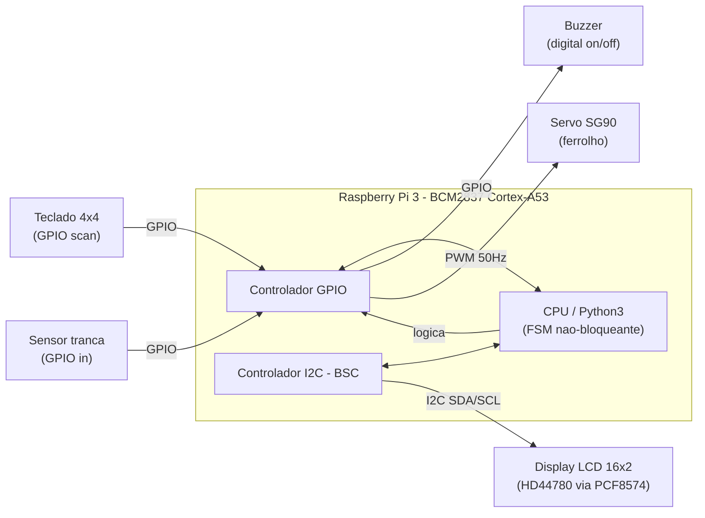
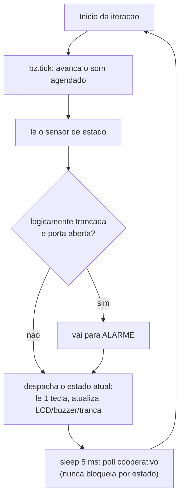
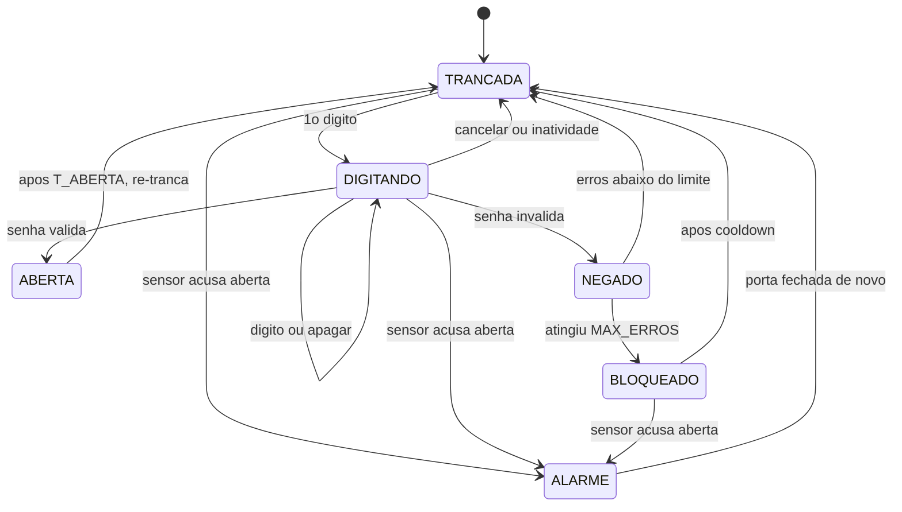
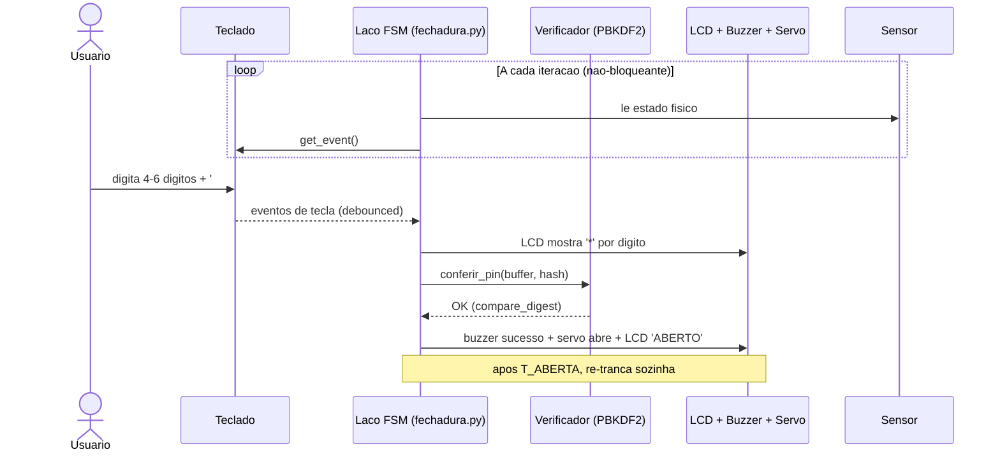

# Relatório da Experiência 8 — Fechadura Eletrônica no Raspberry Pi 3

**PCS3732 — Laboratório de Processadores**
**Escola Politécnica da Universidade de São Paulo**

---

## 1. Introdução e objetivos

Esta experiência tem por objetivo projetar, implementar e validar uma **fechadura eletrônica** sobre um **Raspberry Pi 3 Model B**, integrando quatro periféricos sob uma única lógica de controle: **entrada de senha por teclado matricial**, **feedback de status em um display LCD via I²C**, **feedback sonoro por buzzer** e a **verificação da integridade física da tranca por um sensor**. Como atuador da tranca (o "ferrolho"), acrescenta-se um **servomotor**. O sistema é, em essência, uma **máquina de estados de segurança embarcada**: recebe uma credencial, valida-a, aciona a tranca e monitora continuamente o estado físico da porta.

O Raspberry Pi 3 é construído em torno do SoC Broadcom **BCM2837**, que integra um cluster **quad-core ARM Cortex-A53 (ARMv8, 64 bits) a 1,2 GHz**. Trata-se de uma arquitetura ARM de carregamento/armazenamento, sobre a qual roda o **Raspberry Pi OS, um Linux de propósito geral — não um sistema operacional de tempo real (RTOS)** —, fato que, como na Experiência 7, permeia as decisões de engenharia: nenhuma temporização crítica pode confiar em latência determinística do escalonador.

Os requisitos e a arquitetura derivam diretamente do fluxo de estados não-bloqueante proposto no enunciado da missão (Aula 10): *Idle → Evento de Entrada → Processamento → Sucesso/Falha*. A **decisão arquitetural central** — que atende ao ponto mais crítico do enunciado — é manter o **laço de monitoramento estritamente não-bloqueante**: a varredura do teclado e a leitura do sensor ocorrem a cada iteração e o feedback sonoro é agendado por tempo decorrido (não por `sleep` bloqueante), de modo que o buzzer **nunca congela** a detecção de teclas nem a vigilância do sensor.

---

## 2. Requisitos e arquitetura

### 2.1 Requisitos funcionais, não-funcionais e casos de teste

A matriz abaixo consolida a matriz de validação do enunciado (RF1–RF3, RNF1) e a estende com requisitos adicionais de projeto (RF04–RF05, RNF02–RNF04). Cada linha associa um requisito ao seu caso de teste e ao comportamento esperado observável (telemetria).

| ID | Requisito | Caso de teste | Esperado (telemetria) |
|---|---|---|---|
| **RF01** | Registrar senha numérica pelo teclado | Inserir sequência de 4 a 6 dígitos, incluindo *backspace* (`*`) e submeter (`#`) | Captura exata, sem repique (*bouncing*) de teclas |
| **RF02** | LCD exibe o status em tempo real | Transição de estado bloqueado → desbloqueado | Atualização da tela em < 200 ms após validação |
| **RF03** | Sensor verifica a integridade física da tranca | Abertura forçada da porta (com a tranca logicamente travada) | Disparo de alerta no LCD **e** no buzzer |
| **RF04** | Feedback sonoro distinto | Sucesso vs. erro vs. alerta | Bipe curto duplo / bipe longo / sirene intermitente |
| **RF05** | Acionamento da tranca ao validar | Senha correta submetida | Servo/relé abre; após *timeout*, re-tranca sozinha |
| **RNF01** | Confiabilidade: recuperação de erros | Múltiplas entradas incorretas seguidas | Bloqueio temporário (*cooldown*) **sem travamento do SO** |
| **RNF02** | Não-bloqueio (responsividade) | Buzzer tocando durante digitação/monitoramento | Teclado e sensor continuam respondendo durante o som |
| **RNF03** | Segurança da credencial | Inspeção do armazenamento e da comparação | Senha só como *hash* (PBKDF2+sal); comparação em tempo constante |
| **RNF04** | *Debouncing* das teclas | Uma pressão física | Exatamente um evento de tecla registrado |

### 2.2 Materiais e montagem

**Hardware:**

- Raspberry Pi 3 Model B (SoC BCM2837, Cortex-A53 quad-core) com Raspberry Pi OS.
- Placa de expansão **Freenove Projects Board**.
- Teclado matricial **4×4** (8 GPIOs).
- Display **LCD 16×2 (HD44780)** com **backpack I²C (PCF8574)**.
- Buzzer **ativo** (sinal digital on/off).
- Sensor de estado da tranca: **ultrassônico HC-SR04** (TRIG + ECHO).
- Servomotor **SG90** como atuador do ferrolho.

**Software:** Python 3 com **RPi.GPIO** para GPIO e **smbus/smbus2** para o barramento I²C.

#### Tabela de pinos (numeração BCM)

| Componente | GPIO (BCM) | Função | Configuração elétrica |
|---|---|---|---|
| Teclado — linhas | 16, 20, 21, 26 | Saídas de varredura | Repouso LOW; acionadas HIGH uma a uma |
| Teclado — colunas | 19, 13, 6, 5 | Entradas de leitura | *Pull-down* (ativo-alto)¹ |
| LCD (SDA) | GPIO2 | Dados I²C | Barramento i2c-1 |
| LCD (SCL) | GPIO3 | Clock I²C | Barramento i2c-1 |
| Buzzer | GPIO12 | Sinal digital on/off | Saída digital |
| Tranca (servo SG90) | GPIO18 | PWM 50 Hz | Saída; alimentar servo por fonte 5 V externa² |
| Sensor ultrassônico | TRIG 14 / ECHO 15 | Medida de distância | ECHO via **divisor de tensão** (5 V → 3,3 V)³ |

¹ Reaproveita-se a varredura *pull-down* validada na Experiência 6: GPIO13/19 já nascem em *pull-down*, mas GPIO5/6 nascem em *pull-up*, exigindo a fixação `gpio=5,6,13,19=ip,pd` no `/boot/firmware/config.txt` (ver README).
² O SG90 pode puxar corrente excessiva do Pi em movimento; recomenda-se fonte 5 V externa com GND comum.
³ O pino ECHO do HC-SR04 opera em 5 V e **não** pode ser ligado diretamente a um GPIO de 3,3 V.

#### Figura 1 — Diagrama de blocos da arquitetura física

**Legenda — Figura 1:** o teclado e o sensor são entradas por GPIO; o buzzer e o servo são saídas por GPIO; o LCD é a única carga no barramento I²C (dois fios: SDA/SCL). A CPU executa a máquina de estados que costura tudo. A escolha do I²C para o LCD e sua justificativa estão na Seção 6.1.

---

## 3. Implementação isolada dos componentes

Seguindo a **Regra de Ouro** do enunciado — *"nunca integre um componente que não passou em seu próprio teste unitário"* —, cada periférico foi implementado e validado em um módulo isolado antes da integração. Isso reduz o espaço de busca durante a depuração (Seção 6.3).

### 3.1 Teclado matricial (`keypad.py`) — RF01, RNF04

Um teclado 4×4 usa apenas **8 pinos** (4 linhas + 4 colunas) por **multiplexação**, em vez dos 17 pinos que 16 botões independentes exigiriam. A varredura energiza uma linha por vez e lê qual coluna acusa a conexão. Adota-se aqui o esquema **pull-down (ativo-alto)** validado na Experiência 6: linhas em repouso LOW, levadas a HIGH durante a leitura; colunas em *pull-down* que vão a 1 quando a tecla fecha o contato.

O ponto de engenharia é o ***debouncing*** (RNF04). O repique de contato de uma chave mecânica é real e mensurável, tipicamente na faixa de poucos milissegundos, daí a recomendação usual de janela de *debounce* de **20 a 50 ms**. A classe `Keypad` emite **um único evento por pressão física** por detecção de borda com janela de rejeição, e o faz de forma **não-bloqueante** (`get_event()` retorna imediatamente), condição necessária para a integração na FSM. É o equivalente ao `bouncetime` (em milissegundos) do RPi.GPIO e ao `bounce_time` (em segundos) do gpiozero.

### 3.2 Display LCD via I²C (`lcd_i2c.py`) — RF02

O LCD é baseado no controlador **Hitachi HD44780**, operado no **modo de 4 bits** (usa apenas DB4–DB7; cada byte é enviado em dois *nibbles*, o alto antes do baixo). Em vez de acionar o barramento paralelo diretamente (6+ GPIOs), usa-se um **expansor de E/S PCF8574**, que fala I²C e cujos 8 bits mapeiam os pinos do HD44780 no arranjo típico **RS=P0, RW=P1, EN=P2, backlight=P3, D4–D7=P4–P7**. O driver escreve cada byte em dois *strobes* do pino EN e executa a sequência canônica de inicialização de 4 bits (`0x33, 0x32, 0x28, 0x0C, 0x06, 0x01`), correspondente a *function set*, *display on/cursor off*, *entry mode* e *clear*. O teste isolado escreve `Hello World` e valida o endereçamento com `i2cdetect -y 1` (tipicamente `0x27` para o PCF8574 ou `0x3F` para o PCF8574A).

### 3.3 Buzzer (`buzzer.py`) — RF04, RNF02

Usa-se um **buzzer ativo** (oscilador interno; basta nível digital ALTO para apitar), conforme o diagrama do enunciado ("Sinal Digital"). O módulo define três semânticas sonoras — **sucesso** (dois bipes curtos), **erro** (um bipe longo) e **alerta** (sirene intermitente). O ponto crítico (RNF02) é que **dar duração ao bipe com `sleep` congelaria a varredura do teclado e o sensor** — exatamente o *"Código Bloqueante"* apontado como ameaça à integração no enunciado. Por isso a classe `Buzzer` reproduz padrões de forma **não-bloqueante**: `play(padrão)` agenda segmentos (ligado/desligado, em segundos) e `tick()`, chamado a cada iteração do laço, avança a agenda medindo o tempo com `time.perf_counter()` (relógio monotônico).

### 3.4 Sensor de estado da tranca (`sensor.py`) — RF03

O enunciado pede um *"Sensor Ultrassônico (ou similar)"* com interface GPIO por interrupção/polling. Adota-se o **HC-SR04**: o GPIO `TRIG` emite um pulso de 10 µs, o transdutor dispara um trem de 8 pulsos ultrassônicos e o GPIO `ECHO` permanece em nível alto pelo tempo de voo do eco; a distância é `d = (t_echo · v_som) / 2`, com `v_som ≈ 343 m/s`. A porta é considerada **TRANCADA** quando a distância medida cai abaixo de um limiar (`--limiar-cm`, padrão 8 cm) — ou seja, o ferrolho/porta está fisicamente próximo ao sensor. Se o eco não retornar dentro do *timeout* (obstáculo fora de alcance ou ausente), assume-se **ABERTA** por segurança (falha para o estado observável, não para o estado "trancado").

### 3.5 Atuador da tranca (`trava.py`) — RF05

O ferrolho é movido por um **servomotor SG90** (`trancada = 0°`, `destrancada = 90°`), com seleção automática de *backend*: **pigpio** (pulso temporizado por DMA, suave) quando o *daemon* está no ar, ou **RPi.GPIO** (PWM por software, sujeito a tremor) como *fallback* — a mesma hierarquia de estabilidade discutida na Experiência 7. Há ainda a opção de **relé/solenoide** acionado por um GPIO digital. O atuador nasce sempre no estado **trancado** (falha segura).

---

## 4. Integração: máquina de estados não-bloqueante (`fechadura.py`)

### 4.1 Arquitetura de estados

Uma **máquina de estados finita (FSM)** é a ferramenta correta para este problema: em vez de espalhar o histórico de eventos por muitas variáveis, concentra-se o comportamento em **uma variável de estado** com um número pequeno de valores conhecidos, reduzindo drasticamente os caminhos de execução. Os estados são:

- **TRANCADA** (*idle*): aguarda o primeiro dígito, monitorando o sensor.
- **DIGITANDO**: acumula a senha (com `*` = apagar, `D` = cancelar, `#` = submeter); LCD mostra o caractere ofuscado (`*`); *timeout* de inatividade retorna a TRANCADA.
- **ABERTA**: senha válida → servo abre + LCD "ABERTO"; após `T_ABERTA` re-tranca sozinha (RF05).
- **NEGADO**: senha inválida → bipe longo + incremento do contador de falhas.
- **BLOQUEADO**: após `MAX_ERROS` falhas consecutivas → *cooldown* temporizado (RNF01).
- **ALARME**: sensor indica porta ABERTA enquanto a tranca está logicamente travada → violação física (RF03).

### 4.2 O laço não-bloqueante (RNF02)

O método `passo()` é chamado repetidamente e **nunca bloqueia**: a cada iteração ele (1) avança o som (`bz.tick()`), (2) lê o sensor, (3) verifica violação física, (4) despacha o estado atual e (5) lê no máximo um evento de tecla. O único `sleep` do laço é um **intervalo de *poll* cooperativo** de 5 ms — muito menor que a janela de *debounce* e imperceptível ao usuário —, que evita 100 % de CPU sem prejudicar a responsividade. As **únicas** esperas verdadeiras são os movimentos discretos do servo nas transições abre/fecha, momentâneos e **fora** do laço de monitoramento. Essa separação é o que garante que o buzzer, o teclado e o sensor coexistam sem que um congele o outro.

Como referência de projeto maduro, o próprio RPi.GPIO oferece detecção de eventos por *callback* em uma segunda *thread* (`add_event_detect`), pensada para ser usada num laço junto com outras tarefas e que, ao contrário do *polling* ingênuo, não perde a mudança de estado; o gpiozero expõe o mesmo por `when_pressed`. Optou-se aqui pela varredura *polled* explícita por transparência didática, mas a arquitetura de estado é compatível com ambos.

#### Figura 2 — Fluxograma de uma iteração do laço (`passo()`)

**Legenda — Figura 2:** cada iteração é curta e determinística: o som avança por agenda (`tick`), o sensor é sempre lido, a violação é checada e o estado é despachado. O único `sleep` é o intervalo de *poll* (5 ms), que não representa bloqueio de estado — é o que garante o RNF02.

### 4.3 Figura 3 — Diagrama de estados

**Legenda — Figura 3:** transições da fechadura. O estado ALARME é alcançável de qualquer estado logicamente-trancado quando o sensor acusa porta aberta (RF03); o *cooldown* (BLOQUEADO) implementa a recuperação de erros do RNF01 sem travar o processo.

### 4.4 Figura 4 — Diagrama de sequência (fluxo de sucesso)

**Legenda — Figura 4:** o laço lê sensor e teclado continuamente; ao submeter, a senha é conferida contra o *hash* em tempo constante (Seção 7.2) e, se válida, dispara o feedback multimodal e a abertura.

---

## 5. Plano de integração

A integração é **incremental** (a "abordagem iterativa" do enunciado), validando cada camada antes de acrescentar a próxima; cada etapa tem critério de aceite ligado a requisitos.

**Degrau 1 — Núcleo + Sensor.** Laço vazio que apenas lê o sensor e imprime transições. *Aceite (RF03):* a leitura reflete corretamente porta aberta/fechada.

**Degrau 2 — + Teclado.** Integrar `keypad.get_event()` ao laço e montar o *buffer* de senha. *Aceite (RF01, RNF04):* dígitos capturados sem repique; `*`/`#`/`D` funcionam.

**Degrau 3 — + LCD.** Espelhar o estado no display a cada transição. *Aceite (RF02):* a tela atualiza em < 200 ms após a validação (a escrita ocorre imediatamente na transição, apenas quando o conteúdo muda).

**Degrau 4 — + Buzzer (não-bloqueante).** Agendar os padrões sonoros e chamar `tick()` no laço. *Aceite (RF04, RNF02):* durante um bipe, o teclado e o sensor continuam respondendo.

**Degrau 5 — + Tranca + segurança.** Ligar o servo à validação e a lógica de *hash*/cooldown/alarme. *Aceite (RF05, RNF01, RNF03):* senha correta abre e re-tranca; três erros disparam *cooldown* sem travar o SO; a violação física dispara ALARME.

---

## 6. Discussão teórica (perguntas do enunciado)

### 6.1 Como o I²C é implementado/suportado no Raspberry Pi 3?

O suporte ao I²C no RPi3 estrutura-se em três camadas. **No hardware**, o SoC BCM2837 (herdeiro do BCM2835) integra controladores I²C dedicados — os **BSC (Broadcom Serial Controllers)** —, roteados por padrão para **GPIO2 (SDA1)** e **GPIO3 (SCL1)**, o barramento chamado `i2c-1`. **No sistema operacional**, a interface é habilitada pelo **Device Tree** via `dtparam=i2c_arm=on`, sendo `i2c_arm_baudrate` a velocidade do barramento, com **padrão de 100000 (100 kHz)**. O kernel expõe cada adaptador como um **arquivo de dispositivo de caractere** (major 89, nomes `i2c-0`, `i2c-1`, …) por meio do módulo **`i2c-dev`**; o programa abre `/dev/i2c-1` com `open(..., O_RDWR)` e seleciona o escravo pelo `ioctl(I2C_SLAVE)`. **No nível de aplicação**, bibliotecas de alto nível abstraem a sinalização: a **`smbus`/`smbus2`** (Python puro, *drop-in* de `smbus`) abre o barramento com `SMBus(1)` e envia bytes diretos ao endereço do LCD — é o padrão `import smbus; bus = smbus.SMBus(1); bus.write_byte(...)` usado em `lcd_i2c.py`.

Um detalhe historicamente relevante: o controlador I²C do BCM283x implementa ***clock stretching* de forma incorreta**, checando o estado do *clock* depois de liberá-lo em vez de garantir tempo mínimo em nível alto; com escravos que esticam o *clock* no momento errado, o pulso de clock pode ficar curto demais, dessincronizando a transferência. Para um LCD HD44780 (escravo simples, sem *clock stretching* agressivo) o problema não se manifesta, mas ele explica por que alguns sensores I²C exigem reduzir a *baudrate* no RPi.

### 6.2 Quais os principais desafios para integração dos componentes?

O enunciado destaca três ameaças:

1. **Conflito de recursos (pinos GPIO).** Definir o mesmo GPIO em múltiplos módulos gera comportamento errático. *Mitigação:* uma **tabela de pinos única** (Seção 2.2), reutilizada por todos os módulos, e a instanciação única do modo BCM na integração.
2. **Código bloqueante.** Usar `sleep()` para dar duração ao buzzer congela a varredura do teclado e "cega" o sensor — assim como, no Arduino, usar `delay()` faz o microcontrolador perder eventos de tecla enquanto está parado. *Mitigação:* o laço cooperativo não-bloqueante (Seção 4.2).
3. **Gerenciamento de estado.** Sem uma estrutura clara, o sistema "se perde" quando vários eventos concorrem. *Mitigação:* a FSM explícita com uma única variável de estado.

Somam-se desafios elétricos: o **ECHO do HC-SR04 é de 5 V** (exige divisor para os 3,3 V do Pi) e o **servo puxa corrente** que pode reiniciar o Pi (exige fonte externa com GND comum).

### 6.3 Quais as melhores práticas para depuração?

A prática recomendada é o **funil de isolamento de falhas**, do físico ao lógico:

- **Camada física:** verificar conexões, firmeza dos *jumpers* e tensões (3,3 V × 5 V) com multímetro ou inspeção visual.
- **Camada de sistema/driver:** confirmar que o SO reconhece o hardware — `dmesg | tail` e, para o LCD, `i2cdetect -y 1` (o endereço `0x27`/`0x3F` deve aparecer).
- **Camada lógica:** *logs*/prints **com *timestamp*** para monitorar o fluxo da FSM, e o retorno aos **testes unitários isolados** (Seção 3) para separar defeito de hardware, de fiação e de software — a **Regra de Ouro**.

O caso do teclado é exemplar: a maioria das chaves mecânicas exibe repique abaixo de 10 ms, mas há *outliers* de até dezenas de milissegundos, por isso a recomendação de *debounce* de 20–50 ms e a medição objetiva do repique antes de fixar o parâmetro. Erros documentados — *o que deu errado e como foi corrigido* — são, como diz o enunciado, **evidências de engenharia sólida**.

### 6.4 Como a documentação suporta a reprodutibilidade?

A reprodutibilidade por terceiros depende de três pilares: **registrar como cada resultado foi produzido**, **arquivar as versões exatas de todos os programas externos** e **manter os scripts sob controle de versão** com **acesso público**. No projeto isso se materializa em: (1) **diagramas de fiação** claros — o padrão-ouro é uma ferramenta CAD aberta como o **Fritzing**, com vistas *breadboard*, esquemática e PCB —, garantindo que as conexões de GPIO e I²C sejam replicadas sem curto-circuitos; (2) **registro de dependências** (RPi.GPIO, smbus, versão do kernel); e (3) **instruções de inicialização** no README (habilitar I²C, `config.txt`, `make run`). O exemplo histórico é o código do **Apollo Guidance Computer**, preservado e reexecutável décadas depois graças à digitalização meticulosa e à emulação de código aberto do projeto Virtual AGC, que roda inclusive em Raspberry Pi: a missão não termina no código — termina quando outro engenheiro consegue reproduzi-lo.

---

## 7. Desafio: análise de segurança

### 7.1 Vetor de ataque — *tampering* físico e *spoofing* de sensor

Aplicando o modelo **STRIDE**, a fechadura é mais exposta a **Spoofing** (falsificar a leitura do sensor) e **Tampering** (modificar dados/estado físico). O sensor ultrassônico HC-SR04 infere "porta fechada" indiretamente, pela **distância medida** — e não por um contato físico direto —, o que abre um vetor de ataque próprio:

- **Motivação do atacante:** obter acesso físico não autorizado ao ambiente protegido.
- **Passo 1:** acessar a fiação exposta do sensor (falha de *hardening* físico).
- **Passo 2:** posicionar um **anteparo/objeto refletor** a poucos centímetros do transdutor (ou cobrir o TRIG/ECHO), forçando uma leitura de distância abaixo do limiar e, portanto, o estado lógico "FECHADO" no software, **independentemente da porta real**. O ataque funciona porque o HC-SR04 mede **apenas o tempo de voo do eco mais próximo**, sem qualquer forma de autenticar a origem ou a identidade do refletor.
- **Passo 3:** arrombar fisicamente a porta.
- **Impacto:** o Raspberry Pi continua processando o estado "trancado", o ALARME (buzzer/LCD) **nunca dispara**, e a segurança lógica do sistema é **anulada**.

**Mitigações de projeto:** (a) **redundância** — cruzar a leitura ultrassônica com um sensor de tecnologia distinta (p.ex. reed switch ou microchave no próprio ferrolho), exigindo consenso entre ambos para considerar a porta fechada; (b) *tamper detection* na caixa e fiação embutida; (c) **plausibilização temporal** da leitura (rejeitar transições de distância fisicamente implausíveis, ex.: variação instantânea maior que a velocidade máxima esperada da porta). Vetores lógicos complementares — **força bruta do PIN** e **ataque de temporização** na comparação — são endereçados pelo *cooldown* (RNF01) e pela comparação em tempo constante (RNF03).

### 7.2 Como a criptografia poderia ser utilizada

O primeiro uso é **nunca armazenar a senha em texto plano**. Guarda-se um **hash com sal**. Contudo, hashes **rápidos** como o SHA-256 puro são inadequados para senhas, pois permitem bilhões de tentativas por segundo em GPU. A recomendação é uma **função de derivação de chave (KDF) lenta e ajustável**: Argon2id (preferida), scrypt, bcrypt ou, para conformidade FIPS, **PBKDF2-HMAC-SHA256**, com contagem de iterações a mais alta que o desempenho de verificação permitir (tipicamente ao menos dezenas de milhares) e sal com pelo menos 32 bits.

O projeto implementa exatamente isso em `fechadura.py`: `hashlib.pbkdf2_hmac("sha256", pin, sal, 100000)` com sal de 16 bytes de `os.urandom()`. O dispositivo guarda apenas `sal$hash`; em produção o *hash* é gerado **offline** (`--gerar-hash`) e só ele é implantado, de modo que o texto plano **nunca** toca o Pi. A comparação usa **`hmac.compare_digest`**, que evita análise de temporização não fazendo curto-circuito baseado no conteúdo — do contrário, a comparação byte-a-byte com curto-circuito vazaria o segredo por diferenças de tempo mensuráveis. Se a fechadura se conectasse a uma rede IoT, a comunicação também deveria ser cifrada (TLS).

### 7.3 Dificuldade de usar criptografia no ESP32 vs. no Raspberry Pi 3

| | Raspberry Pi 3 (Cortex-A53 + Linux) | ESP32 (microcontrolador) |
|---|---|---|
| **Prós** | Processamento abundante; bibliotecas completas (OpenSSL, `hashlib`, PBKDF2/scrypt nativos) | **Aceleradores em hardware** (AES, SHA, RSA/bignum, RNG); *Secure Boot v2* e *Flash Encryption*; execução determinística (FreeRTOS) |
| **Dificuldades** | Vulnerável a *timing attacks* e injeção devido ao escalonador imprevisível do Linux e à vasta superfície de ataque de um SO completo | RAM limitada; gerência de chaves/certificados complexa sem um SO completo |

No **ESP32**, o ESP-IDF integra um *fork* do mbedTLS com rotinas de hardware habilitáveis por `CONFIG_MBEDTLS_HARDWARE_AES/SHA/MPI/ECC`, e aceleradores dedicados de AES/RSA/SHA/RNG, com o RSA suportando exponenciação modular de grandes números via multiplicação de Montgomery. Além disso, o **Secure Boot v2** usa RSA-PSS 3072 bits + SHA-256 ancorados em *eFuse* e a **Flash Encryption** cifra o *firmware* em AES-256 com chave em *eFuse* inacessível por software — uma **raiz de confiança em hardware** difícil de replicar no RPi3. Em contrapartida, o **RPi3** faz criptografia "de software" com folga de CPU, mas seu Linux de propósito geral (não-RTOS) tem **jitter** de escalonamento que amplia a superfície para *timing attacks* — daí a importância de `compare_digest` e de KDFs de custo fixo. Em resumo: o ESP32 é **mais forte em raiz de confiança e determinismo**, o RPi3 é **mais forte em capacidade e ecossistema de bibliotecas**; a dificuldade migra de "ter o recurso" (ESP32: gerência de chaves) para "usá-lo com segurança temporal" (RPi3: determinismo).

---

## 8. Resultados: o que deu certo, o que deu errado e como refinar

> **Nota metodológica:** os valores medidos **ainda não foram coletados**; a tabela lista os resultados **esperados** e reserva a coluna **Medido** para preenchimento em bancada. Nenhum número de medição foi inventado.

| Grandeza / requisito | Esperado | Medido (preencher) |
|---|---|---|
| Latência de atualização do LCD após validação (RF02) | < 200 ms | [medir] |
| Eventos de tecla por pressão física (RNF04) | exatamente 1 | [medir] |
| Falsos disparos de tecla com *debounce* 40 ms | ~0 | [medir] |
| Erros consecutivos até *cooldown* (RNF01) | 3 | [medir] |
| Duração do *cooldown* sem travar o SO (RNF01) | 15 s; laço/sensor ativos | [medir] |
| Tempo de verificação PBKDF2 (100 k iter.) no Cortex-A53 | dezenas a ~200 ms | [medir] |
| ALARME após abertura forçada (RF03) | dispara buzzer + LCD | [medir] |
| Endereço I²C do LCD (`i2cdetect`) | `0x27` ou `0x3F` | [medir] |

**Hipóteses/problemas esperados (a confirmar):**

- **H1 — Repique do teclado:** sem *debounce*, dígitos duplicados; *como endereçar:* medir o repique e ajustar a janela em 20–50 ms.
- **H2 — Endereço I²C divergente:** LCD em `0x3F` (PCF8574A) em vez de `0x27`; *como endereçar:* `i2cdetect -y 1` e `--lcd-addr`.
- **H3 — *Clock stretching* / fios longos no I²C:** telas corrompidas; *como endereçar:* encurtar fios e, se necessário, reduzir a *baudrate*.
- **H4 — Tremor/consumo do servo:** *reset* do Pi ao mover o servo; *como endereçar:* fonte 5 V externa e, para suavidade, pigpio/DMA.
- **H5 — Custo do PBKDF2:** 100 k iterações podem introduzir latência perceptível na verificação; *como endereçar:* medir e calibrar o número de iterações ao equilíbrio segurança×responsividade.
- **H6 — Falso "trancado" do ultrassônico:** obstáculo/reflexo espúrio a poucos cm do sensor pode ser lido como porta fechada; *como endereçar:* validar o limiar (`--limiar-cm`) em bancada com a porta real, em várias posições.

---

## 9. Conclusão

A fechadura foi estruturada em **módulos isolados** (`keypad.py`, `lcd_i2c.py`, `buzzer.py`, `sensor.py`, `trava.py`) validados antes da integração e reunidos por uma **máquina de estados finita estritamente não-bloqueante** (`fechadura.py`), na qual o feedback sonoro é agendado por tempo decorrido e o teclado e o sensor jamais são congelados — a resposta direta ao maior risco de integração apontado no enunciado. A arquitetura respeita as características do Raspberry Pi 3: um **Linux de propósito geral (não-RTOS)** sobre um Cortex-A53, onde os requisitos são *soft real-time* e o I²C é suportado nativamente (BSC + `i2c-dev` + smbus), reduzindo a fiação do LCD a dois fios. Do ponto de vista de segurança, o projeto adota as boas práticas canônicas — **senha só como *hash* PBKDF2 com sal**, **comparação em tempo constante** e **cooldown** contra força bruta — e reconhece, com honestidade de engenharia, sua fragilidade dominante: o ***spoofing* do sensor ultrassônico** por obstrução/reflexo forçado, cuja mitigação exige redundância de sensores, *tamper detection* e plausibilização temporal da leitura. Deixa-se preparada a bancada de medições (Seção 8) para confirmar quantitativamente as hipóteses de repique, latência, custo do KDF e disparo de alarme, fechando o ciclo entre projeto, teoria e verificação experimental.
